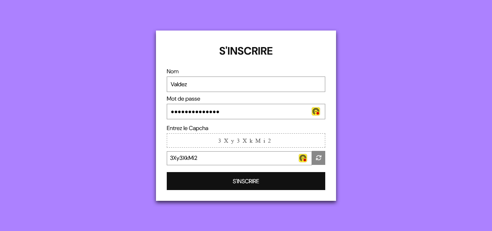

## FORMULAIRE AVEC CAPTCHA

## Le challenge

Ce projet représente un formulaire d'inscription à un site avec captcha. Un captcha est un test requis pour accéder à certains services sur Internet, qui consiste à saisir une courte séquence visible sur une image, afin de différencier les utilisateurs humains d'éventuels robots malveillants.

L'internaute devra remplir correctement les différents champs de formulaire ainsi que le captcha afin de valider son inscription. Il peut également cliquer sur le bouton refresh afin d'obtenir un autre captcha.

- Effet de remplissage sur le bouton S'inscrire

## Démonstration

Lien vers le projet : https://aperbet56.github.io/registration_form_captcha/

## Projet développé avec

- Utilisation des balises sémantiques HTML5
- CSS3
- Flexbox
- Animation CSS (transition)
- Utilisation d'un normaliseur : le fichier normalize.css
- Importation de la police "DM Sans"
- Page web responsive
- Desktop first
- JavaScript
- Code JavaScript commenté
